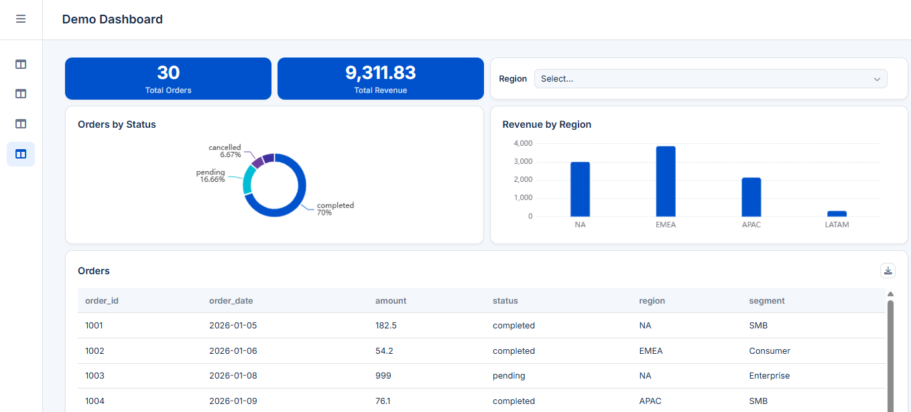

# BuchiMaker


<p align="center">
  
  <br>
  
  
  
  
  
</p>

<br clear="left">
<br>

BuchiMaker is an API-first web application for building visual data dashboards. It reads your data (CSV, JSON, or partitioned Parquet) into an embedded [DuckDB](https://duckdb.org/) engine, lets you define dashboards as YAML — one flattened "base view" per dashboard, with SQL-defined totals, aggregates, and filters on top — and serves them through a REST API to a small static-HTML/Vue frontend.
It is ideal for prototyping or hosting internal dashboards with big volume of data.

> It is not a replacement for a full BI platform (Power BI, Looker, Tableau). The model is deliberately narrow: **one ready-to-query data source per dashboard**, transformed/joined once into a `base_view`, with every widget and filter operating on that one shape. See [`docs/dashboard_parser.md`](docs/dashboard_parser.md) for the full dashboard YAML spec.

## Features
**Available**
- Web application that allows to build custom dashboards
- Fast backend that can deal with big volumes of data (DuckDB + Redis)
- Define your dashboards in YAML
- Load your data sources from variety of supported formats (CSV, JSON, Parquete)
- Configure and use SSO (OIDC)

**In-progress or not present yet**
- Data Sources: BigQuery Support
- Table widget: column resizing
- Table widget: column sorting
- Audit logs: export to a remote syslog server



## Architecture at a glance

- **Backend** — FastAPI + DuckDB (Python 3.11, `backend/`). One DuckDB connection per process, file-backed rather than `:memory:` so the OS can page under memory pressure. See [`docs/backend_architecture.md`](docs/backend_architecture.md) for the full ADR list; a few decisions worth knowing up front:
  - **Active/standby DB swap**: data reloads happen into a second "standby" DuckDB file, which is atomically promoted once loaded — so a refresh never serves a half-loaded table. The main data-engine DB is rebuilt from your data sources on *every container startup*; it's a cache, not a source of truth.
  - **Audit log is a separate DuckDB file**, isolated from that reload cycle, so audit history survives even though the main engine gets rebuilt from scratch on restart.
  - **Redis is a cache, not a dependency of correctness**: the first request for a given dashboard+filter combination hits DuckDB and caches the (gzip-compressed) result in Redis; the app degrades gracefully (always queries DuckDB) if Redis is unavailable.
  - **DuckDB is single-process, multi-read** — it does not support concurrent cross-process writers to the same file. This shapes how the app can and can't be scaled; see [Scaling](#scaling) below.
- **Frontend** — static HTML/Vue served by nginx (`frontend/`), no build step or Node toolchain required at runtime. It calls the backend over `API_BASE_URL`, injected at container start via `envsubst` (`frontend/entrypoint.sh`) — no rebuild needed to point it at a different backend.
- **Widgets** — pluggable per-type Vue components loaded from a "widget set" folder (`frontend/widgets/default/` ships as the bundled default), so custom widget themes/sets can be dropped in without touching core frontend code.
- **Dashboards as data, not code** — dashboards are YAML files loaded via API (`POST /api/v1/dashboards/load`), parsed and validated against the spec in `docs/dashboard_parser.md`, not hardcoded into the app. Dashboard YAML files are a mix of the markup (layout description) and SQLs for widgets.
- **Vue and eCharts** - Frontend is developed using Vue, Gridstack.js, and eCharts. Widgets can be extended to support other [eCharts types](https://echarts.apache.org/examples/en/index.html).

## Technical Details
- [Security considerations to deploy in production](./docs/security.md)
- [Frontend Architecture](./docs/frontend_architecture.md)
- [Backend Architecture](./docs/backend_architecture.md)
- [Notes on performance and scaling](./docs/scaling.md)
- [Notes on troubleshooting](./docs/troubleshooting.md)
- [How to add new widget / chart types](./docs/adding-new-widget-type.md)
- [How dashboard widgets are rendered, and how to build a custom widget package](./docs/widget_bundles.md)

## How to Run 

### 1. Seed example dashboards, data, and settings

The repo ships a `templates/` folder with a minimal working example — a small sample dataset, a dashboard that runs against it, and default settings files. Nothing under `dashboards/`, `data/`, or `settings/` is committed to git (see `.gitignore`) or shipped pre-populated, so run the seed script once after cloning:

```bash
./scripts/init-onboarding.sh
```

This copies `templates/dashboards/*` → `dashboards/`, `templates/data/*` → `data/`, and `templates/settings/*` → `settings/`. It never overwrites a file that's already there, so it's safe to re-run at any point — including after you've started registering your own data sources and dashboards.

`dashboards/template.yaml` is a separate reference file also seeded by the same script — it demonstrates every supported widget type and validation rule, but it isn't runnable as-is (its `base_view` joins against data sources this project doesn't ship). Use it as a syntax reference, not a demo.

**Every CSV/JSON/Parquet data source must live under `./data`.** When you register one (`POST /api/v1/system/data-sources/{csv|json|parquet}`), its `filepath` is required to resolve inside the container's `DATA_DIR` (`/app/data`, i.e. whatever host folder you bind-mount to `./data` in `docker-compose.yml`) — the backend rejects any path outside it, including `../` traversal attempts, with a `422`. This isn't configurable per-request: put the file somewhere under `./data` (subfolders are fine) first, then reference it as `/app/data/<...>` in the request. See ADR-013 in [`docs/backend_architecture.md`](docs/backend_architecture.md) for why, and [Security](#security-recommendations-for-public-cloud-deployment) for what this does and doesn't protect against.

### 2. Configure environment (optional)

```bash
cp .env.example .env
```

Edit `.env` if you need to change CORS origins, the frontend's backend URL, or any of the host-side ports (see [Port overrides](#port-overrides) below). The defaults work out of the box for a single machine running everything locally.

### 3. Build and run everything

```bash
docker compose up --build -d
```

This builds the backend (`backend/Dockerfile`) and frontend (`frontend/Dockerfile`) images, starts Redis, and brings all three services up on the `buchi-net` bridge network. First boot with the seeded templates should give you:

- API: http://localhost:8000/api/v1
- Health check: http://localhost:35400/healthz *(served on its own dedicated port — see `HEALTH_HOST_PORT`)*
- Frontend: http://localhost:3000
- Demo dashboard: visible in the frontend once loaded, or directly at `GET /api/v1/dashboards/demo_dashboard`

Redis (port 6379) and the backend's API/health ports are exposed to the host for local development convenience only — see [Security](#security-recommendations-for-public-cloud-deployment) before deploying anywhere reachable from the internet.

### 4. Building and running backend/frontend separately

Useful for local development without the full compose stack (e.g. iterating on one service, or the pattern used in `docs/debugging.md`):

**Backend**, run directly with Python (fastest iteration loop — no image rebuild per change):
```bash
cd backend
python -m venv .venv && source .venv/bin/activate
pip install --require-hashes -r requirements.txt
DEBUG=true DASHBOARDS_DIR=../dashboards DATA_DIR=../data python main.py
```
Redis is optional here — the app logs a warning and falls back to querying DuckDB directly if it can't connect.

`requirements.txt` is a compiled, hash-pinned lockfile (`--require-hashes` fails the install if anything, including a transitive dependency, doesn't match a recorded hash) — see [Dependency lockfile](#dependency-lockfile) below if you need to add or bump a package.

**Frontend**, built and run as a standalone container (mirrors `frontend/rerun.sh`):
```bash
cd frontend
docker build -t buchi-frontend .
docker run -d -p 3000:80 \
  -e API_BASE_URL="http://localhost:8000/api/v1" \
  --name buchi-frontend-app buchi-frontend
```

Rebuilding after a change to frontend static files (`frontend/*.js`, `frontend/widgets/**`) requires re-running `docker build` — nginx serves baked-in files, there's no dev server/hot-reload. See `docs/adding-new-widget-type.md` for the full "what needs a rebuild vs. what's just a mount" table.

### Port overrides

`docker-compose.yml` reads host-side ports from environment variables (default shown):

| Variable | Default | Maps to |
|---|---|---|
| `API_HOST_PORT` | `8000` | Backend main API |
| `HEALTH_HOST_PORT` | `35400` | Backend `/healthz` (separate port so liveness probes stay immune to API-level overload — see ADR-004 in `docs/backend_architecture.md`) |
| `REDIS_HOST_PORT` | `6379` | Redis (only needs host exposure for local debugging with a Redis client — not required in production) |
| `FRONTEND_HOST_PORT` | `3000` | Frontend nginx (container listens on 80 internally) |
| `REDISINSIGHT_HOST_PORT` | `5540` | RedisInsight web UI (when launched via `backend/tests/compose-redis-insight.yml`) |

Set these in `.env` (copy `.env.example`) rather than editing `docker-compose.yml`. `API_BASE_URL`/`AUTH_BASE_URL` default to the relative paths `/api/v1`/`/auth` — nginx proxies these to the backend container internally (`frontend/nginx.conf`), so they don't need to track `API_HOST_PORT` at all; only override them to an absolute URL if you're bypassing that proxy and pointing the frontend at a backend on a different origin (see [Security](#security-recommendations-for-public-cloud-deployment) below — that also requires further cookie/CORS changes).

(`ALLOW_ORIGINS` defaults to `*` and is effectively unused in the default same-origin topology — see [Security](#security-recommendations-for-public-cloud-deployment) below if you go cross-origin.)

